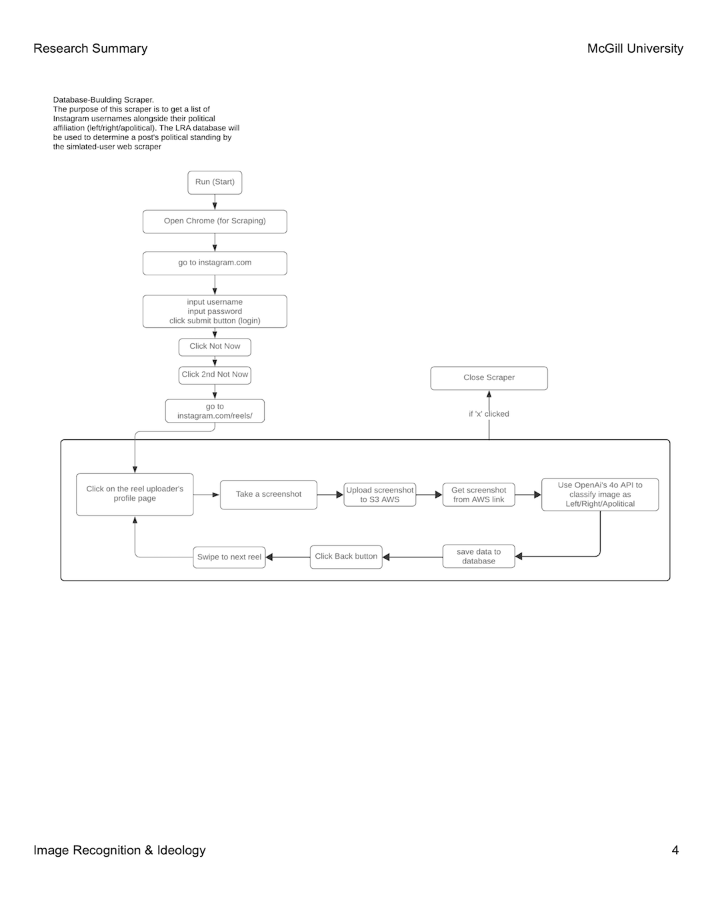
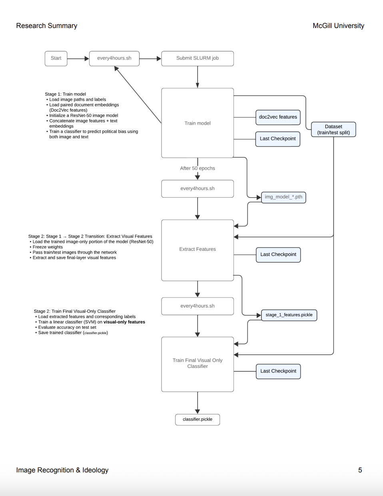
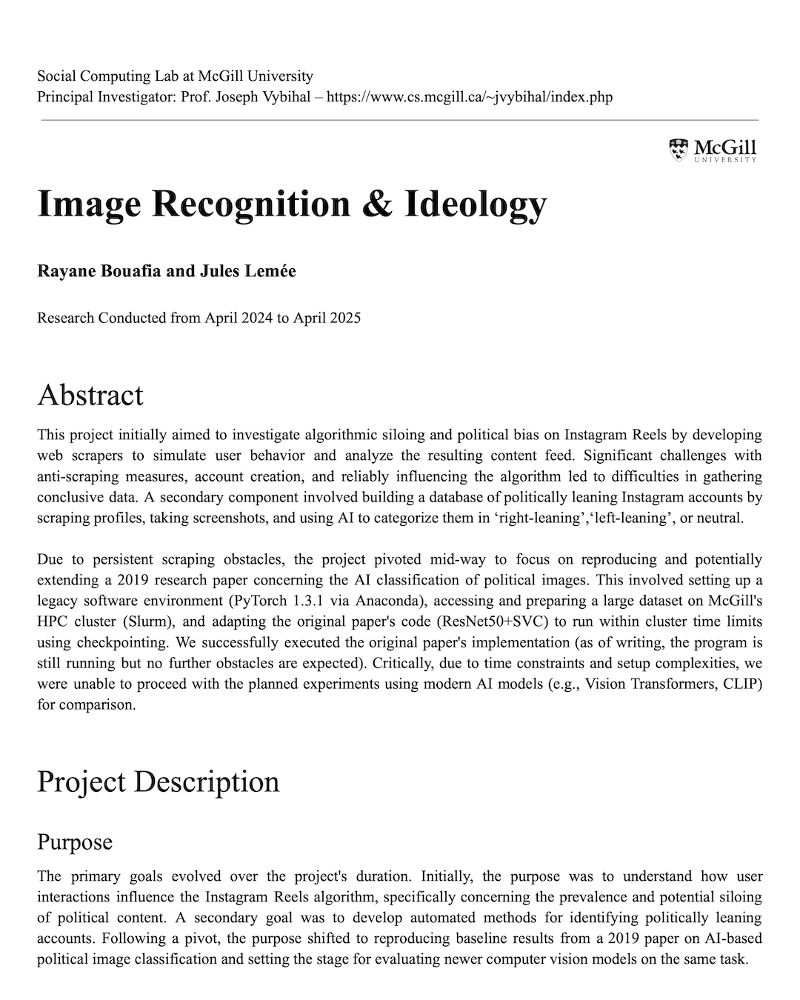

# Instagram Political Bias Research 🔍

Academic research investigating political bias in social media algorithms through automated data collection and machine learning analysis.

**📄 Full Paper:** https://research.juleslemee.com

## What This Research Does

This study examines how Instagram's algorithm creates political filter bubbles by systematically collecting and analyzing recommendation patterns across different user personas. In part 2, we also recreated a 2019 paper that created its own model to detect political bias in images.

## Example of part 1: the scraper building a database of accounts with their political leaning


*Part 1 methodology: automated user simulation and data collection*

## Example of part 2: the workflow to create the final classifier from the 2019 paper


*Part 2 methodology: computer vision and algorithmic bias detection*



*Project Summary paper with findings and analysis*

## Why This Research Matters

**The Problem:** Social media algorithms create "echo chambers" that reinforce existing political beliefs, potentially polarizing society. Understanding how these systems work is crucial for digital literacy and informed civic participation.

**Our Approach:** By creating controlled experiments with bot accounts, we can systematically study algorithmic bias without relying on self-reported user data or proprietary company information.

**Academic Impact:** This research contributes to the growing field of algorithmic auditing and provides methodologies for studying recommendation systems across social platforms.

## Research Components

### Part 1: Automated Data Collection System
- **Simulated User Behavior**: Bot accounts with different political personas
- **Systematic Interaction Tracking**: Automated likes, follows, and engagement patterns  
- **Recommendation Analysis**: Monitoring how algorithm suggestions change over time
- **Political Content Classification**: Building databases of politically-labeled accounts

### Part 2: Computer Vision Analysis
- **Bias Detection in Images**: Adapting [Thomas & Kovashka (2019)](https://people.cs.pitt.edu/~chris/politics/) methodology
- **High-Performance Computing**: Custom SLURM implementations for GPU cluster training
- **Feature Extraction**: CLIP and Doc2Vec models for image analysis
- **Classification Pipeline**: End-to-end bias detection system

## Key Features

✅ **Automated Data Collection** - Selenium-based Instagram scrapers  
✅ **Political Bias Detection** - Computer vision analysis of images  
✅ **High-Performance Computing** - SLURM GPU cluster implementation  
✅ **Academic Rigor** - Peer-reviewed methodology and findings  
✅ **Reproducible Research** - Complete codebase and documentation  
✅ **Real-World Impact** - Insights into social media algorithmic bias  

## How to Reproduce This Research

### Prerequisites
- Python 3.7+ with virtual environment capability
- Access to Instagram Accounts (for Part 1) or GPU cluster (for Part 2)
- Git for cloning repositories

### Part 1: Data Collection Setup

1. **Clone and Configure**
   ```bash
   git clone https://github.com/juleslemee/instagram-algorithm-research.git
   cd instagram-algorithm-research/research-part-1
   pip install -r requirements.txt
   ```

2. **Set Up Credentials** 
   ```bash
   cp input/keys/credentials.example.py input/keys/credentials.py
   cp input/keys/openai_key.example.py input/keys/openai_key.py
   # Edit files with your actual credentials
   ```

3. **Run Data Collection**
   ```bash
   python src/mainsim.py  # Automated user simulation
   python src/maincol.py  # Political account collection
   ```

### Part 2: Machine Learning Analysis

1. **Prepare Environment**
   ```bash
   cd research-part-2
   pip install -r requirements.txt
   ```

2. **Download Original Dataset**
   - Visit [Thomas & Kovashka project page](https://people.cs.pitt.edu/~chris/politics/)
   - Download 130GB dataset to project directory

3. **Run Analysis** (GPU Cluster)
   ```bash
   module load slurm
   sbatch slurm_all.sh  # For continuous training
   ```

## Project Structure

```
instagram-algorithm-research/
├── research-part-1/          # Instagram data collection
│   ├── src/                  # Scraping and automation scripts
│   ├── input/                # Configuration and credentials
│   └── output/               # Collected data and screenshots
└── research-part-2/          # Machine learning analysis
    ├── SLURM outputs/        # GPU cluster training logs
    ├── Models/               # Trained classifiers
    └── Features/             # Extracted image features
```

## Research Findings

- **Filter Bubble Formation**: Documented rapid creation of political echo chambers
- **Algorithmic Amplification**: Measured bias in content recommendation systems
- **Methodological Contributions**: Novel approaches to social media algorithm auditing
- **Technical Challenges**: Identified limitations in automated data collection

## Academic Context

**Institution**: McGill University  
**Course**: COMP 396 - Individual Research Project  
**Supervisor**: Professor Joseph Vybihal  
**Collaborator**: Rayane Bouafia  

## Ethical Considerations

- All data collection followed academic ethical guidelines
- Bot accounts were clearly identified in profile descriptions  
- No private user information was collected
- Research aims to promote algorithmic transparency

## Technologies Used

- **Web Automation**: Selenium WebDriver, Python
- **Machine Learning**: PyTorch, CLIP, Doc2Vec, scikit-learn
- **Computer Vision**: OpenCV, PIL
- **High-Performance Computing**: SLURM, GPU clusters
- **Data Processing**: pandas, NumPy

## Citations & References

This research builds upon and adapts:
- Thomas, C. & Kovashka, A. (2019). "Who's Behind the Camera? Identifying the Authorship of a Photograph"
- McGill University computing resources
- Instagram's public API and web interface

## License

MIT License - See LICENSE file for academic and research use permissions.
